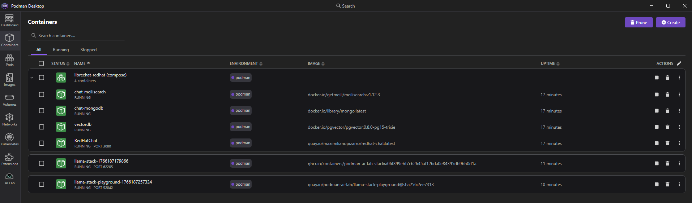
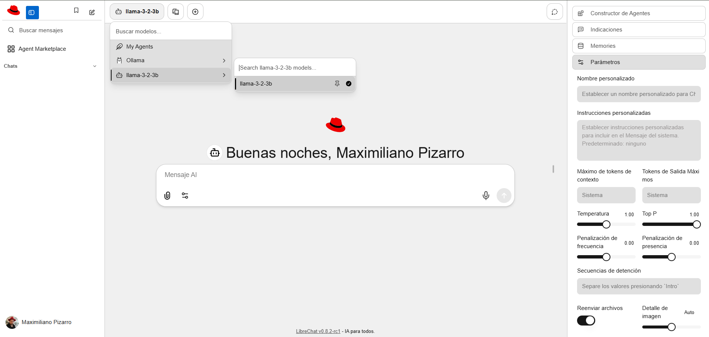
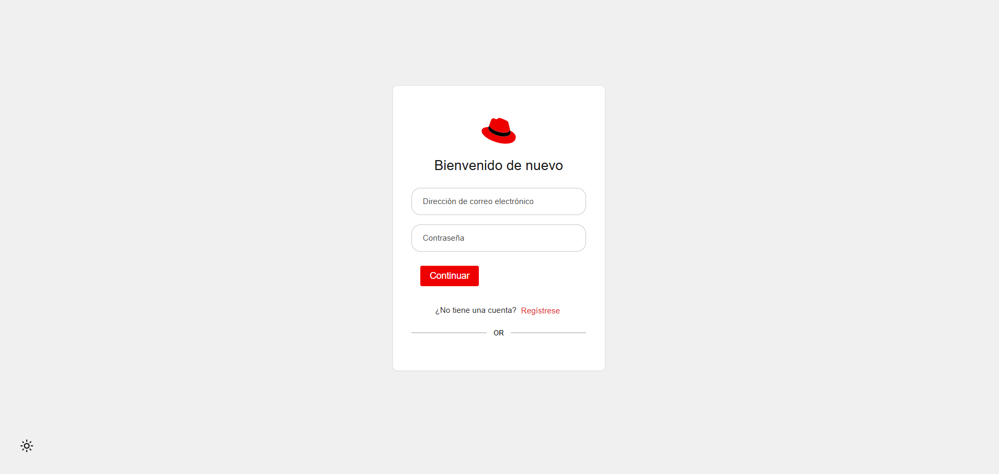
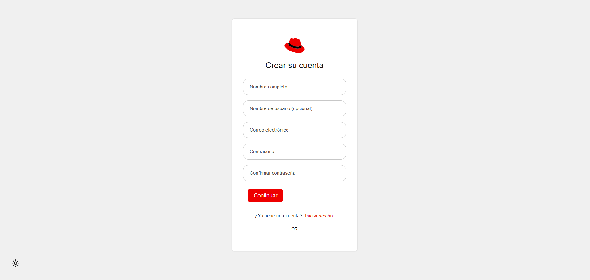
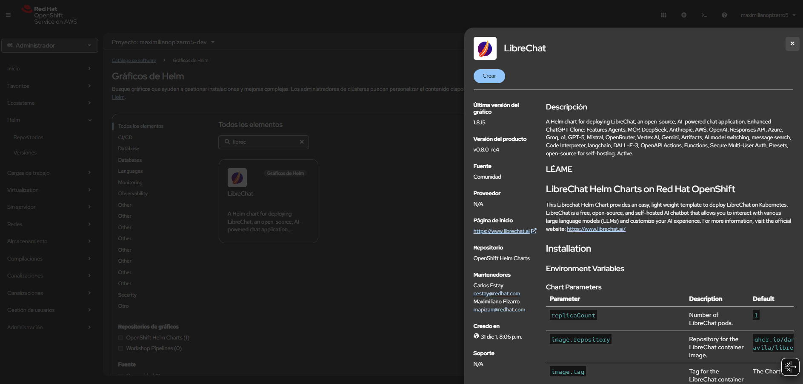

<div align="center">


<a href="https://github.com/maximilianoPizarro/LibreChat-RedHat"></a>
<a href="https://quay.io/repository/maximilianopizarro/redhat-chat"></a>
</div>

<div align="center" style="margin: 2rem 0;">
  <h1>Red Hat Chat</h1>
  <p style="font-size: 1.2rem; color: #666; margin-top: 0.5rem;">
    <em>Powered by LibreChat with Red Hat Design System</em>
  </p>
</div>

<div align="center" style="margin: 2rem 0;">
  <iframe width="900" height="506" src="https://www.youtube.com/embed/SDzLeBEiOG0" title="YouTube video player" frameborder="0" allow="accelerometer; autoplay; clipboard-write; encrypted-media; gyroscope; picture-in-picture; web-share" allowfullscreen style="max-width: 100%; border-radius: 4px; display: block; margin: 0 auto;"></iframe>
</div>
<div align="center" style="margin-top: 1rem; margin-bottom: 2rem;">
  <p style="font-size: 0.875rem; color: #888; font-style: italic; margin: 0;">Red Hat Chat - Deploy locally with Podman or on OpenShift</p>
</div>

## 📋 TL;DR

- **Local Deployment**: Run with Podman using `podman-compose` or `podman compose`
- **OpenShift Deployment**: Install from the catalog using image `quay.io/maximilianopizarro/redhat-chat:latest`
- **Container Image**: Available on [Quay.io](https://quay.io/repository/maximilianopizarro/redhat-chat?tab=tags)
- **Requirements**: Podman 4.0+ for local, OpenShift 4.x+ for cluster deployment

## 📖 Overview

Red Hat Chat brings together the future of assistant AIs with the revolutionary technology of OpenAI's ChatGPT, styled with the [Red Hat Design System](https://ux.redhat.com/). This application integrates multiple AI models while maintaining Red Hat's design standards and visual identity.

### Key Features

- 🖥️ **UI & Experience** powered by [Red Hat Design System](https://ux.redhat.com/) with enhanced design and features
- 🤖 **AI Model Selection**: Anthropic (Claude), AWS Bedrock, OpenAI, Azure OpenAI, Google, Vertex AI, and more
- 🔧 **Code Interpreter API**: Secure, sandboxed execution in Python, Node.js, Go, C/C++, Java, PHP, Rust, and Fortran
- 🔦 **Agents & Tools Integration**: No-code custom assistants with MCP server support
- 🔍 **Web Search**: Search the internet and retrieve relevant information
- 🎨 **Image Generation & Editing**: Text-to-image and image-to-image capabilities
- 💬 **Multimodal & File Interactions**: Upload and analyze images, chat with files
- 🌎 **Multilingual UI**: Support for 20+ languages
- 👥 **Multi-User & Secure Access**: OAuth2, LDAP, & Email Login Support

### Container Image

The application is available as a container image on Quay.io:

- **Repository**: `quay.io/maximilianopizarro/redhat-chat`
- **Latest Tag**: `latest`
- **Base Image**: Red Hat UBI8 with Node.js 20
- **Architecture**: Multi-arch support (amd64, arm64)

<div align="center">
  
</div>

---

## 🚀 Running Locally with Podman

This section explains how to run Red Hat Chat locally using Podman and Podman Compose.

### Prerequisites

1. **Install Podman:**
   ```bash
   # RHEL/Fedora
   sudo dnf install podman
   
   # Ubuntu/Debian
   sudo apt-get install podman
   
   # Windows
   # Download Podman Desktop from https://podman-desktop.io/
   ```

2. **Install Podman Compose:**
   ```bash
   # Using pip
   pip3 install podman-compose
   
   # Or use native podman compose (Podman 4.0+)
   # No additional installation needed
   ```

3. **Verify Installation:**
   ```bash
   podman --version
   podman compose version  # or podman-compose --version
   ```

### Quick Start

1. **Clone the repository:**
   ```bash
   git clone https://github.com/maximilianoPizarro/LibreChat-RedHat.git
   cd LibreChat-RedHat
   ```

2. **Configure environment variables:**
   ```bash
   # Copy example environment file
   cp env.example.podman .env
   
   # Edit .env and configure required variables:
   # - MEILI_MASTER_KEY (generate a secure key)
   # - JWT_SECRET (generate a secure key)
   # - JWT_REFRESH_SECRET (generate a secure key)
   ```

3. **Start services with Podman Compose:**
   ```bash
   # Using native podman compose (recommended)
   podman compose -f podman-compose.yml up -d
   
   # Or using podman-compose
   podman-compose -f podman-compose.yml up -d
   ```

4. **Access the application:**
   - Open your browser and navigate to: `http://localhost:3080`
   - The application should be running with all services (MongoDB, Meilisearch, etc.)

<div align="center">
  
</div>

### First Steps: Login and Registration

Once you access the application, you'll see the welcome screen. Red Hat Chat supports multiple authentication methods:

- **Email Login**: Use your email address and password
- **User Registration**: Create a new account (if registration is enabled)
- **OAuth2**: Login with external providers (if configured)
- **LDAP**: Enterprise authentication (if configured)

<div align="center">
  
</div>

<div align="center">
  
</div>

### Using Pre-built Container Image

Alternatively, you can use the pre-built image from Quay.io:

```bash
# Pull the latest image
podman pull quay.io/maximilianopizarro/redhat-chat:latest

# Run with podman-compose (recommended)
# Edit podman-compose.yml to use the image instead of building
```

Or run directly with Podman:

```bash
podman run -d \
  --name redhat-chat \
  -p 3080:3080 \
  -e MONGO_URI=mongodb://mongodb:27017/LibreChat \
  -e MEILI_HOST=http://meilisearch:7700 \
  quay.io/maximilianopizarro/redhat-chat:latest
```

### Container Services

The `podman-compose.yml` includes the following services:

- **redhat-chat**: Main application container
- **mongodb**: MongoDB database for data storage
- **meilisearch**: Search engine for conversation search
- **vectordb**: PostgreSQL with pgvector for RAG capabilities (optional)
- **rag_api**: RAG API service (optional, requires OPENAI_API_KEY)

### Managing Services

```bash
# Start services
podman compose -f podman-compose.yml up -d

# Stop services
podman compose -f podman-compose.yml down

# View logs
podman compose -f podman-compose.yml logs -f

# Rebuild and restart
podman compose -f podman-compose.yml up -d --build
```

### Troubleshooting

**Port already in use:**
```bash
# Change PORT in .env file
PORT=3081
```

**MongoDB connection issues:**
```bash
# Check MongoDB container
podman ps | grep mongodb
podman logs chat-mongodb
```

**Podman socket connection:**
```bash
# On Linux, enable podman socket
systemctl --user enable --now podman.socket
export DOCKER_HOST=unix://$XDG_RUNTIME_DIR/podman/podman.sock
```

<div align="center">
  
</div>

---

## ☸️ Deploying on OpenShift from Catalog

This section explains how to deploy Red Hat Chat on OpenShift using the container image from Quay.io through the OpenShift catalog.

> **💡 Tip:** The Helm chart for Red Hat Chat (LibreChat) is **pre-installed** in many OpenShift clusters and can be found in the OpenShift Developer Catalog under "Helm Charts". For comprehensive Helm chart documentation, advanced configuration, and deployment strategies, visit [**Red Hat Chat Helm Chart Documentation**](https://maximilianopizarro.github.io/librechat/).

<div align="center">
  
  <p style="color: #888; font-size: 0.9rem; margin-top: 0.5rem;">The Helm chart for Red Hat Chat (LibreChat) is available in the OpenShift Developer Catalog under "Helm Charts"</p>
</div>

### Prerequisites

- Access to an OpenShift cluster (4.x or later)
- Permissions to create deployments, services, and routes in a namespace
- OpenShift CLI (`oc`) installed (optional, can use web console)

### Method 1: Using OpenShift Web Console (Recommended)

#### Step 1: Access the Developer Catalog

1. Log in to your OpenShift web console
2. Navigate to **Developer** perspective (top menu)
3. Click on **+Add** in the left sidebar
4. Select **Container Images** from the catalog

<div align="center">
  <p><em>Screenshot: OpenShift Developer Catalog - Navigate to +Add → Container Images</em></p>
  <p style="color: #888; font-size: 0.9rem;">In the OpenShift web console, go to Developer perspective → +Add → Container Images</p>
</div>

#### Step 2: Search for the Container Image

1. In the **Image name** field, enter:
   ```
   quay.io/maximilianopizarro/redhat-chat:latest
   ```
2. Click **Search** or press Enter
3. Select the image from the results

<div align="center">
  <p><em>Screenshot: Search results showing quay.io/maximilianopizarro/redhat-chat:latest</em></p>
  <p style="color: #888; font-size: 0.9rem;">The search will display the Red Hat Chat image from Quay.io</p>
</div>

#### Step 3: Configure the Deployment

1. **Application Name**: Enter `redhat-chat` (or your preferred name)
2. **Name**: This will be auto-filled, you can modify if needed
3. **Resource Type**: Select **Deployment**
4. **Namespace**: Choose or create a namespace for the deployment

#### Step 4: Configure Container Settings

1. **Container Port**: Set to `3080` (default application port)
2. **Environment Variables**: Add required environment variables:
   - `MONGO_URI`: Connection string to MongoDB
   - `MEILI_HOST`: Meilisearch host URL
   - `JWT_SECRET`: Generate a secure JWT secret
   - `JWT_REFRESH_SECRET`: Generate a secure refresh secret
   - `MEILI_MASTER_KEY`: Generate a secure Meilisearch master key

   **Tip**: You can create a Secret first and reference it:
   ```bash
   oc create secret generic redhat-chat-secrets \
     --from-literal=jwt-secret=$(openssl rand -hex 32) \
     --from-literal=jwt-refresh-secret=$(openssl rand -hex 32) \
     --from-literal=meili-master-key=$(openssl rand -hex 16) \
     -n your-namespace
   ```

3. **Resource Limits**: Configure CPU and memory limits as needed
4. **Storage**: Add persistent volumes if needed for data storage

#### Step 5: Create Route

1. Check **Create a route to the application**
2. Configure route settings:
   - **Route name**: `redhat-chat` (or your preferred name)
   - **Target port**: `3080`
   - **TLS**: Select **Edge** termination (recommended)

#### Step 6: Deploy

1. Click **Create** to start the deployment
2. Wait for the deployment to complete
3. Access the application using the route URL provided

<div align="center">
  <p><em>Screenshot: Red Hat Chat deployment status in OpenShift</em></p>
  <p style="color: #888; font-size: 0.9rem;">Once deployed, you'll see the deployment status and route URL in the OpenShift console</p>
</div>

After successful deployment, you can access Red Hat Chat through the OpenShift route. The application will display the same welcome screen and login interface as shown in the local deployment:

<div align="center">
  
</div>

### Method 2: Using OpenShift CLI (oc)

#### Step 1: Login to OpenShift

```bash
oc login --server=<your-openshift-server-url>
```

#### Step 2: Create Namespace

```bash
oc create namespace redhat-chat
oc project redhat-chat
```

#### Step 3: Create Secrets

```bash
# Generate secure keys
JWT_SECRET=$(openssl rand -hex 32)
JWT_REFRESH_SECRET=$(openssl rand -hex 32)
MEILI_MASTER_KEY=$(openssl rand -hex 16)

# Create secret
oc create secret generic redhat-chat-secrets \
  --from-literal=jwt-secret=$JWT_SECRET \
  --from-literal=jwt-refresh-secret=$JWT_REFRESH_SECRET \
  --from-literal=meili-master-key=$MEILI_MASTER_KEY
```

#### Step 4: Create Deployment

```bash
oc new-app \
  --name=redhat-chat \
  --image=quay.io/maximilianopizarro/redhat-chat:latest \
  --env=MONGO_URI=mongodb://mongodb:27017/LibreChat \
  --env=MEILI_HOST=http://meilisearch:7700 \
  --env-from=secret/redhat-chat-secrets
```

#### Step 5: Expose Service

```bash
# Create route
oc expose service redhat-chat

# Or create route with custom settings
cat <<EOF | oc apply -f -
apiVersion: route.openshift.io/v1
kind: Route
metadata:
  name: redhat-chat
  namespace: redhat-chat
spec:
  to:
    kind: Service
    name: redhat-chat
  port:
    targetPort: 3080
  tls:
    termination: edge
    insecureEdgeTerminationPolicy: Redirect
EOF
```

#### Step 6: Get Route URL

```bash
oc get route redhat-chat -o jsonpath='{.spec.host}'
```

### Method 3: Using Helm Chart

The project includes a Helm chart for easier deployment. **Note:** The Helm chart for Red Hat Chat (LibreChat) is pre-installed in many OpenShift clusters and can be found in the OpenShift Developer Catalog under "Helm Charts".

#### Using Pre-installed Helm Chart in OpenShift

1. **Access the Developer Catalog:**
   - Log in to your OpenShift web console
   - Navigate to **Developer** perspective
   - Click on **+Add** → **Helm Charts**
   - Search for "librechat" or "redhat-chat"

<div align="center">
  
  <p style="color: #888; font-size: 0.9rem; margin-top: 0.5rem;">The Helm chart for Red Hat Chat (LibreChat) is available in the OpenShift Developer Catalog</p>
</div>

2. **Install from Catalog:**
   - Select the Helm chart from the catalog
   - Configure the values (image repository, environment variables, etc.)
   - Click **Install** to deploy

#### Using Helm CLI

If you prefer using the Helm CLI or the chart is not available in your cluster's catalog:

```bash
# Add the chart repository or use local chart
helm install redhat-chat ./helm/librechat \
  --namespace redhat-chat \
  --create-namespace \
  --set image.repository=quay.io/maximilianopizarro/redhat-chat \
  --set image.tag=latest
```

#### Additional Helm Chart Documentation

For comprehensive Helm chart documentation, advanced configuration options, environment variables, OpenID Connect setup, and deployment strategies, visit:

**[📚 Red Hat Chat Helm Chart Documentation](https://maximilianopizarro.github.io/librechat/)**

The documentation includes:
- Complete parameter reference
- Environment variables configuration
- OpenID Connect (OIDC) setup with Red Hat SSO/Keycloak
- LLM endpoint configuration
- Resource limits and GPU configuration
- ArgoCD deployment strategies
- Troubleshooting guides

### Deploying Dependencies

Red Hat Chat requires MongoDB and Meilisearch. You can deploy them using:

#### Option 1: Using OpenShift Catalog

1. Deploy MongoDB from the catalog
2. Deploy Meilisearch from the catalog
3. Update environment variables in Red Hat Chat deployment to point to these services

#### Option 2: Using Helm

The Helm chart includes optional dependencies:

```bash
helm install redhat-chat ./helm/librechat \
  --namespace redhat-chat \
  --create-namespace \
  --set mongodb.enabled=true \
  --set meilisearch.enabled=true \
  --set image.repository=quay.io/maximilianopizarro/redhat-chat \
  --set image.tag=latest
```

### Verifying Deployment

```bash
# Check deployment status
oc get deployment redhat-chat -n redhat-chat

# Check pods
oc get pods -n redhat-chat -l app=redhat-chat

# View logs
oc logs -f deployment/redhat-chat -n redhat-chat

# Check route
oc get route redhat-chat -n redhat-chat
```

### Updating the Application

To update to a newer version:

```bash
# Update image tag in deployment
oc set image deployment/redhat-chat \
  redhat-chat=quay.io/maximilianopizarro/redhat-chat:latest \
  -n redhat-chat

# Or using the web console:
# 1. Go to Deployment → redhat-chat
# 2. Click Actions → Edit deployment
# 3. Update the image tag
# 4. Save
```

### Troubleshooting

**Image pull errors:**
```bash
# Check if image is accessible
podman pull quay.io/maximilianopizarro/redhat-chat:latest

# Check image pull secrets
oc get secrets -n redhat-chat | grep registry
```

**Deployment not starting:**
```bash
# Check deployment events
oc describe deployment redhat-chat -n redhat-chat

# Check pod events
oc describe pod <pod-name> -n redhat-chat

# Check logs
oc logs <pod-name> -n redhat-chat
```

**Route not accessible:**
```bash
# Check route status
oc get route redhat-chat -n redhat-chat -o yaml

# Test service directly
oc get svc redhat-chat -n redhat-chat
oc port-forward svc/redhat-chat 3080:3080 -n redhat-chat
```

---

## 🎨 Red Hat Design System Integration

This application uses the [Red Hat Design System (RHDS)](https://ux.redhat.com/get-started/developers/installation/#npm) for consistent UI components and styling. The frontend is built with:

- **Red Hat Design System Elements** (`@rhds/elements@4.0.0`) - Web components following Red Hat design standards
- **Red Hat Design Tokens** - CSS variables for colors, spacing, typography, and more
- **Red Hat Icons** - Consistent iconography across the application

The design system is loaded via CDN (jsDelivr) for development, and can be configured to use the Red Hat CDN for production deployments on `*.redhat.com` domains.

---

## 📦 Container Image Details

### Image Repository

- **Registry**: Quay.io
- **Repository**: `maximilianopizarro/redhat-chat`
- **Full Image Path**: `quay.io/maximilianopizarro/redhat-chat:latest`

### Available Tags

Check the [Quay.io repository](https://quay.io/repository/maximilianopizarro/redhat-chat?tab=tags) for all available tags:

- `latest` - Latest stable release
- `v0.8.2-rc1` - Specific version tag
- Other version tags as they become available

### Image Architecture

- **Base Image**: `registry.access.redhat.com/ubi8/nodejs-20:latest`
- **Architecture**: Multi-arch (amd64, arm64)
- **Size**: ~500MB (compressed)

### Pulling the Image

```bash
# Pull latest
podman pull quay.io/maximilianopizarro/redhat-chat:latest

# Pull specific version
podman pull quay.io/maximilianopizarro/redhat-chat:v0.8.2-rc1

# Verify image
podman images | grep redhat-chat
```

---

## 🔧 Configuration

### librechat.yaml Configuration

Red Hat Chat uses a `librechat.yaml` configuration file to customize AI endpoints, file handling, rate limits, and more. Below are examples for configuring Llama Stack endpoints.

#### Basic Configuration Structure

The `librechat.yaml` file supports multiple configuration sections:

- **File Configuration**: Limits for file uploads per endpoint
- **Rate Limits**: IP and user-based rate limiting
- **Endpoints**: Custom AI model endpoints (Ollama, Llama models, etc.)
- **Assistants**: Configuration for AI assistants

#### Example 1: Local Ollama with Llama Stack

This example configures Red Hat Chat to use a local Ollama instance running Llama models:

```yaml
version: 1.0.3
cache: true

fileConfig:
  endpoints:
    assistants:
      fileLimit: 5
      fileSizeLimit: 10  # Maximum size for an individual file in MB
      totalSizeLimit: 50  # Maximum total size for all files in a single request in MB
      supportedMimeTypes:
        - "image/.*"
        - "application/pdf"
    openAI:
      disabled: true  # Disables file uploading to the OpenAI endpoint
    default:
      totalSizeLimit: 20
  serverFileSizeLimit: 100  # Global server file size limit in MB
  avatarSizeLimit: 2  # Limit for user avatar image size in MB

rateLimits:
  fileUploads:
    ipMax: 100
    ipWindowInMinutes: 60  # Rate limit window for file uploads per IP
    userMax: 50
    userWindowInMinutes: 60  # Rate limit window for file uploads per user

endpoints:
  assistants:
    disableBuilder: false  # Disable Assistants Builder Interface by setting to `true`
    pollIntervalMs: 750  # Polling interval for checking assistant updates
    timeoutMs: 180000  # Timeout for assistant operations
    fileLimit: 5
    fileSizeLimit: 10   # Maximum size for an individual file in MB
    totalSizeLimit: 50  # Maximum total size for all files in a single request in MB
    supportedMimeTypes:
      - "image/.*"
      - "application/pdf"
  custom:
    # Local Ollama instance with Llama2
    - name: "Ollama"
      apiKey: "IiI="  # Base64 encoded empty string (Ollama doesn't require auth)
      baseURL: "http://librechat-ollama:11434/v1"  # Adjust if Ollama is on a different host
      models:
        default: ["llama2", "llama3", "llama3.2:3b-instruct"]  # Available models
        fetch: true  # Fetch available models from Ollama API
      titleConvo: true
      titleModel: "llama2"
      summarize: false
      summaryModel: "llama2"
```

#### Example 2: Remote Llama Model via Red Hat AI Services

This example shows how to connect to a remote Llama model hosted on Red Hat AI Services:

```yaml
version: 1.0.3
cache: true

fileConfig:
  endpoints:
    assistants:
      fileLimit: 5
      fileSizeLimit: 10
      totalSizeLimit: 50
      supportedMimeTypes:
        - "image/.*"
        - "application/pdf"
    openAI:
      disabled: true
    default:
      totalSizeLimit: 20
  serverFileSizeLimit: 100
  avatarSizeLimit: 2

rateLimits:
  fileUploads:
    ipMax: 100
    ipWindowInMinutes: 60
    userMax: 50
    userWindowInMinutes: 60

endpoints:
  assistants:
    disableBuilder: false
    pollIntervalMs: 750
    timeoutMs: 180000
    fileLimit: 5
    fileSizeLimit: 10
    totalSizeLimit: 50
    supportedMimeTypes:
      - "image/.*"
      - "application/pdf"
  custom:
    # Remote Llama 3.2 3B model via Red Hat AI Services
    - name: "llama-3-2-3b"
      apiKey: "your-api-key-here"  # Replace with your actual API key
      baseURL: "https://llama-3-2-3b-maas-apicast-production.apps.prod.rhoai.rh-aiservices-bu.com:443/v1"
      models:
        default: ["llama-3-2-3b"]
        fetch: false  # Don't fetch, use explicit model list
      titleConvo: true
      titleModel: "llama-3-2-3b"
      summarize: false
      summaryModel: "llama-3-2-3b"
```

#### Example 3: Multiple Llama Models (Local + Remote)

This example demonstrates configuring both local Ollama and remote Llama models:

```yaml
version: 1.0.3
cache: true

fileConfig:
  endpoints:
    assistants:
      fileLimit: 5
      fileSizeLimit: 10
      totalSizeLimit: 50
      supportedMimeTypes:
        - "image/.*"
        - "application/pdf"
    openAI:
      disabled: true
    default:
      totalSizeLimit: 20
  serverFileSizeLimit: 100
  avatarSizeLimit: 2

rateLimits:
  fileUploads:
    ipMax: 100
    ipWindowInMinutes: 60
    userMax: 50
    userWindowInMinutes: 60

endpoints:
  assistants:
    disableBuilder: false
    pollIntervalMs: 750
    timeoutMs: 180000
    fileLimit: 5
    fileSizeLimit: 10
    totalSizeLimit: 50
    supportedMimeTypes:
      - "image/.*"
      - "application/pdf"
  custom:
    # Local Ollama - Lightweight models for development
    - name: "Ollama Local"
      apiKey: "IiI="
      baseURL: "http://localhost:11434/v1"  # Local Ollama instance
      models:
        default: ["llama3.2:3b-instruct", "llama3.2:1b-instruct"]  # Lightweight models
        fetch: true
      titleConvo: true
      titleModel: "llama3.2:3b-instruct"
      summarize: false
      summaryModel: "llama3.2:3b-instruct"
    
    # Remote Llama - Production models
    - name: "Llama 3.2 3B Production"
      apiKey: "${LLAMA_API_KEY}"  # Use environment variable
      baseURL: "https://llama-3-2-3b-maas-apicast-production.apps.prod.rhoai.rh-aiservices-bu.com:443/v1"
      models:
        default: ["llama-3-2-3b"]
      titleConvo: true
      titleModel: "llama-3-2-3b"
      summarize: false
      summaryModel: "llama-3-2-3b"
    
    # Another remote model option
    - name: "Llama 3 70B"
      apiKey: "${LLAMA_70B_API_KEY}"
      baseURL: "https://your-llama-70b-endpoint.com/v1"
      models:
        default: ["llama-3-70b-instruct"]
      titleConvo: true
      titleModel: "llama-3-70b-instruct"
      summarize: true
      summaryModel: "llama-3-70b-instruct"
```

#### Configuration Notes

**For Podman/Container Deployments:**

1. **Mount the configuration file**: Ensure `librechat.yaml` is mounted as a volume in your container:
   ```yaml
   volumes:
     - type: bind
       source: ./librechat.yaml
       target: /app/librechat.yaml
       read_only: true
   ```

2. **Environment Variables**: You can use environment variables in the YAML file:
   ```yaml
   apiKey: "${LLAMA_API_KEY}"
   ```
   Then set the variable in your `.env` file or container environment.

3. **Network Configuration**: For local Ollama, use the container service name:
   ```yaml
   baseURL: "http://librechat-ollama:11434/v1"  # Service name in podman-compose
   ```

**For OpenShift Deployments:**

1. **ConfigMap**: Create a ConfigMap from your `librechat.yaml`:
   ```bash
   oc create configmap librechat-config --from-file=librechat.yaml -n redhat-chat
   ```

2. **Mount ConfigMap**: Mount it in your deployment:
   ```yaml
   volumeMounts:
     - name: config
       mountPath: /app/librechat.yaml
       subPath: librechat.yaml
   volumes:
     - name: config
       configMap:
         name: librechat-config
   ```

3. **Secrets for API Keys**: Store API keys in Secrets:
   ```bash
   oc create secret generic llama-api-keys \
     --from-literal=llama-api-key=your-key-here \
     -n redhat-chat
   ```

#### Available Llama Models

Common Llama models you can use with Red Hat Chat:

- **llama2** - Meta's Llama 2 model (7B, 13B, 70B variants)
- **llama3** - Meta's Llama 3 model (8B, 70B variants)
- **llama3.2:1b-instruct** - Lightweight 1B parameter model
- **llama3.2:3b-instruct** - 3B parameter model (good balance)
- **llama-3-2-3b** - Red Hat AI Services hosted model
- **llama-3-70b-instruct** - Large 70B parameter model

#### Troubleshooting Configuration

**Model not appearing in UI:**
- Check that `fetch: true` is set or models are listed in `default`
- Verify the `baseURL` is correct and accessible
- Check container logs for connection errors

**API Key issues:**
- Ensure API keys are correctly set in environment variables or secrets
- For Ollama local, use `apiKey: "IiI="` (base64 empty string)

**Connection errors:**
- Verify network connectivity between containers
- Check firewall rules for external endpoints
- Ensure service names match in podman-compose.yml

### Environment Variables

Key environment variables for Red Hat Chat:

**Required:**
- `MONGO_URI` - MongoDB connection string
- `MEILI_HOST` - Meilisearch host URL
- `JWT_SECRET` - JWT signing secret (min 32 chars)
- `JWT_REFRESH_SECRET` - JWT refresh secret (min 32 chars)
- `MEILI_MASTER_KEY` - Meilisearch master key (min 16 chars)

**Optional:**
- `PORT` - Application port (default: 3080)
- `DOMAIN` - Application domain
- `ALLOW_REGISTRATION` - Enable user registration (default: true)
- `ALLOW_EMAIL_LOGIN` - Enable email login (default: true)

See `env.example.podman` for a complete list of configuration options.

### Generating Secure Keys

```bash
# Generate JWT secrets (32+ characters)
openssl rand -hex 32

# Generate Meilisearch master key (16+ characters)
openssl rand -hex 16
```

---

## 📚 Additional Resources

**Red Hat Resources:**
- **Red Hat Design System:** [ux.redhat.com](https://ux.redhat.com/)
- **Red Hat UBI:** [developers.redhat.com/products/rhel/ubi](https://developers.redhat.com/products/rhel/ubi)
- **Podman:** [podman.io](https://podman.io/)

**Original LibreChat Resources:**
- **GitHub Repo:** [github.com/danny-avila/LibreChat](https://github.com/danny-avila/LibreChat)
- **Website:** [librechat.ai](https://librechat.ai)
- **Documentation:** [librechat.ai/docs](https://librechat.ai/docs)

**Container Registry:**
- **Quay.io Repository:** [quay.io/repository/maximilianopizarro/redhat-chat](https://quay.io/repository/maximilianopizarro/redhat-chat?tab=tags)

---

## 🆘 Support

For issues, questions, or contributions:

- **GitHub Issues:** [github.com/maximilianoPizarro/LibreChat-RedHat/issues](https://github.com/maximilianoPizarro/LibreChat-RedHat/issues)
- **Documentation:** See project README.md for detailed setup instructions

---

## 📝 License

This project is open source. Please refer to the LICENSE file in the repository for details.

---

<div align="center" style="margin-top: 2rem;">
  <p style="font-size: 0.9rem; color: #888;">
    <strong>Red Hat Chat</strong> - Powered by LibreChat with Red Hat Design System
  </p>
  <p style="font-size: 0.8rem; color: #aaa; margin-top: 0.5rem;">
    Built with ❤️ using Red Hat certified container images
  </p>
</div>
